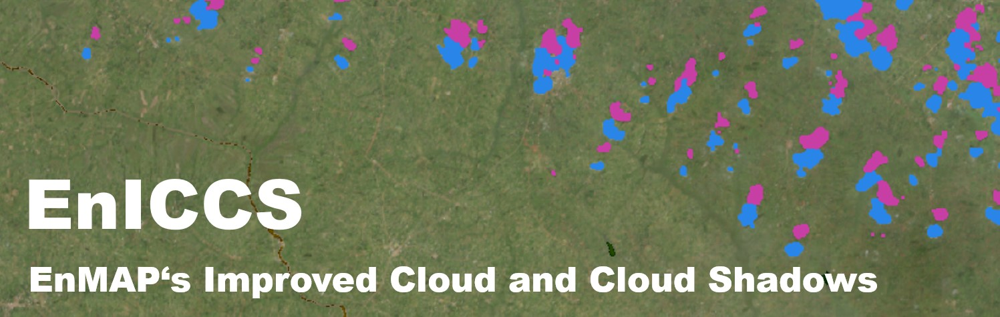
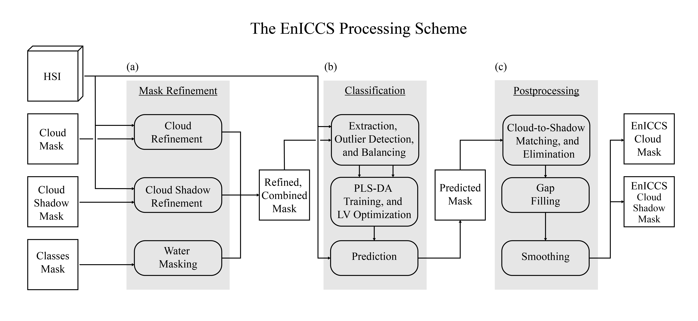
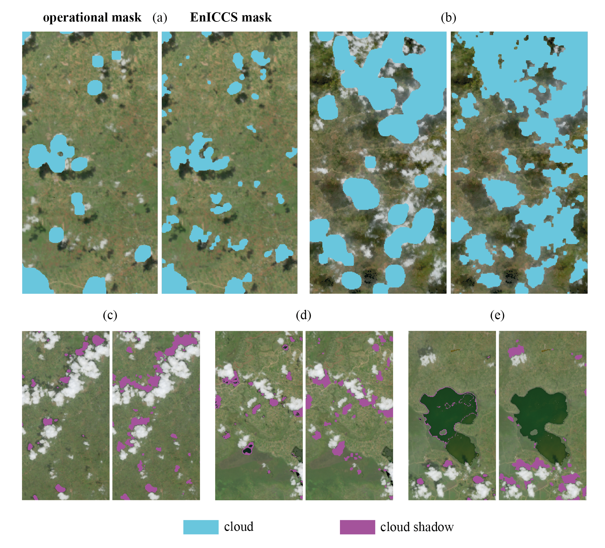

**EnICCS** is a tool for generating improved cloud and cloud shadow masks for EnMAP L2A scenes over land surfaces.  

For details please refer to the accompanying [paper]().

## Table of Contents

- [Background](#background)
- [About EnICCS](#about-eniccs)
- [Example](#example)
- [Installation](#installation)
- [Usage](#usage)
- [Customization](#customization)
- [Contributions](#contributions)
- [Planned Features](#planned-features)
- [EnMAP Cloud and Cloud Shadow Benchmarking Dataset](#enmap-cloud-and-cloud-shadow-benchmarking-dataset)
- [Citation](#citation)
- [Funding and Acknowledgements](#funding-and-acknowledgements)
- [License](#license)

### Background
Current operational cloud and cloud shadow masks often fail to detect small clouds and cloud shadows and lack proper 
cloud boundary delineation. Residual clouds and cloud shadows can significantly distort spectral signatures, 
such that the recorded signal no longer corresponds to the expected ‘clear-sky’ measurement of the observed surface. 
This, in turn, compromises any downstream analysis.

### About EnICCS
EnICCS intends to improve existing cloud and cloud shadow masks through a series of steps.
 1. Operational masks are refined using a combination of narrowband indices, thresholding and masking.
 2. The refined masks are then used to fit a simple PLS-DA model to classify the respective scene.
 3. Predictions are post-processed with a simple cloud-to-shadow matching routine.  

The overall workflow is illustrated below:


EnICCS is simple to use with a single function call and requires only the directory path of the EnMAP L2A data as input.

Various parameters can be adjusted to improve performance while implementation level changes can help adapt the tool to
different regions and surface types. For more details see the [paper] and [customization](#customization) section.

## Example
Some exemplary pairs of EnMAP images with operational (left) and EnICCS masks (right) respectively:




## Installation

You can install **EnICCS** from GitHub using pip:
```bash
pip install git+https://github.com/leleist/eniccs.git
```

## Usage
To use **EnICCS**, you can import it and run the main wrapper function with default parameters.  
Just provide the directory path of the EnMAP L2A data on a tile-by-tile basis, i.e., as provided by DLR.

```python
from eniccs import run_eniccs

dir_path = r"path/to/your/EnMAP/TIFFS"  

# simple call with default parameters
run_eniccs(dir_path)

# new cloud and cloudshadow masks will be saved to "dir_path"
```
**Please note:** EnICCS currently accepts two file types, TIFF and BSQ, with common extensions (.TIFF, .TIF, .tiff, .tif, .BSQ, .bsq)

### Note on Transferability:
EnICCS was developed and tested on EnMAP scenes over smallholder areas of tropical western Kenya.
Application to regions with differing surface characteristics may require adjustments. 
The code structure allows for some optimization with available parameters and simple adaptation, leveraging expert 
knowledge and/or visual inspection. For more details see the accompanying [paper] and [Customization](#customization).

## Customization
EnICCS has two points of contact for customization:

#### 1. Parameter Adjustments
The following parameters can be adjusted when calling the `run_eniccs` function:
```python
run_eniccs(
     dir_path: str,                     # path to EnMAP L2A data
     save_output: bool = True,          # save output masks
     return_mask_obj: bool = False,     # return mask object
     auto_optimize: bool = False,       # optimize the number of latent variables for PLS-DA automatically
     verbose: bool = False,             # print progress messages
     plot: bool = False,                # plot informative plots
     smooth_output: bool = True,        # apply conservative morphological processing for smooting the output masks
     contamination: float = 0.25,       # contamination parameter for LOF outlier detection
     percentile: int = 80,              # percentile for cloud-to-shadow matching routine distance threshold
     num_samples: int = 3000,           # number of samples for PLS-DA training
     n_jobs: int = -1,                  # number of parallel jobs (CPU)
)
```

#### 2. Implementation Level Changes
The main module contains functions for mask refinement i.e. `improve_cloud_mask_over_land` and 
`improve_cloud_shadow_mask` as well as a wrapper `refine_ccs_masks` that integrates the two prior functions into the 
overall workflow.
These functions can be modified. Here, bands, indices and thresholds can be changed to suit the surfaces of interest.
A dedicated unit test ensures that changes are compatible with the overall workflow.

In the context of supervised ML classification, we recall the garbage-in-garbage-out principle.
Thus, the quality of the refined masks used for training is crucial for the performance of the PLS-DA model, 
despite the available post-processing steps.


## Contributions
Contributions are welcome!  
Specifically regarding band indices and thresholds for different surface types (Desert, Snow, Urban).

## Planned Features
 - "no data mode" for using EnICCS as a standalone cloud masking tool, without existing operational masks.


## EnMAP Cloud and Cloud Shadow Benchmarking Dataset
We provide the hand-drawn "gold standard" reference masks for five EnMAP scenes used in the accompanying [paper]() as a 
benchmarking dataset on Zenodo [10.5281/zenodo.17350339](https://doi.org/10.5281/zenodo.17350339).  
For tile-wise performance metrics please consult the [paper]() Supplemental Information.

## Citation

## Funding and Acknowledgements
This work was funded by the German Space Agency at DLR via the German Federal Ministry of Economic Affairs 
and Climate Action under Grant 50EE2303A.

Illustrations contain EnMAP data and modified EnMAP data © DLR [2023, 2024]. All rights reserved.


## License
This project is licensed under the **Apache 2.0** License - see the [LICENSE](LICENSE.txt) file for details.

```


