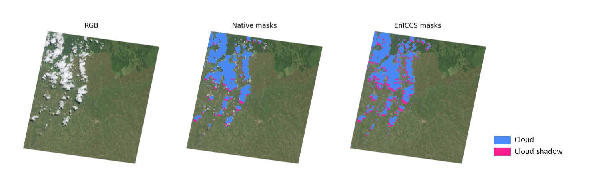

# EnICCS

**EnICCS**: **En**MAP **I**mproved **C**loud and **C**loud **S**hadow masks.  
Is a tool for quickly generating improved cloud and cloud shadow masks for EnMAP L2A scenes.

Current standard cloud and cloud shadow masks often fail to detect small clouds and cloud shadows and lack proper cloud boundary delineation.  
This can lead to contamination of training data and thus reduced accuracy of machine learning models, especially in automated pipelines where manual correction is not feasible.  
This tool uses a combination of narrwoband indices, thresholding and masking to refine the original cloud and cloud shadow masks. The refined masks are then used to train a simple PLS-DA model to classify the respective scene.

EnICCS is simple to use with a single function call, yet modular to allow for customization.

The main aim is to reduce cloud contamination in automated processing chains to improve e.g. ML application outcomes. 


## Table of Contents

- [Installation](#installation)
- [Usage](#usage)
- [Examples](#examples)
- [Notes](#notes)
- [Contributing](#contributing)
- [License](#license)

## Installation

To install **eniccs**, you can use pip:

```bash
pip install eniccs
```

For the latest fixes, you can clone the repository and install it:
```bash
git clone https://github.com/username/eniccs.git
cd repository
pip install -e .
```

## Usage
To use **EnICCS**, you can import it and run the main wrapper function in default configuration.  
Just provide the directory path of the EnMAP data

```python
import eniccs

dir_path = r"path/to/your/EnMAP/TIFFS"
eniccs(dir_path)
```
new cloud and cloudshadow masks will be saved to "dir_path"

## Examples
Here is an example an EnMAP Image with original and EnICCS improved cloud and cloud shadow masks:




## Notes
This projects was developed and tested on ~100 scenes from agricultural areas in western Kenya.
Adjustments may be needed for regions with differing surface properties. 

currently cloud and cloud shadow masks are based on classification and thus highly dependent on good training data. 
While slight postprocessing is applied to the masks, object based logic similar to that used in e.g. Fmask is not yet implemented.

## Contributing
Contributions are welcome!

## License
This project is licensed under the MIT License - see the [LICENSE](LICENSE.txt) file for details.

```


